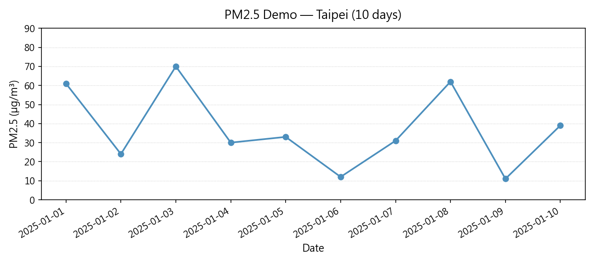

# TW Air Quality Mini

This project loads, cleans, and visualises hourly PM2.5 readings from Taiwan EPA
monitoring stations for 2025. Raw CSV files (one per station) are ingested by
helper functions in `src/`, lightly cleaned to handle missing values and unit
normalisation, and then explored in a Jupyter notebook that produces comparison
charts saved to `reports/`.

## How to run

```bash
# 1. Clone the repo
git clone https://github.com/SuperCandy611/tw-airquality-mini.git
cd tw-airquality-mini

# 2. Create and activate a virtual environment
python -m venv .venv
source .venv/bin/activate        # Windows: .venv\Scripts\activate

# 3. Install dependencies
pip install -r requirements.txt

# 4. Launch the notebook
jupyter notebook notebooks/01_explore.ipynb
```

> Raw CSVs are excluded from version control. Download station files from the
> [Taiwan EPA AQI open data portal](https://data.epa.gov.tw/en/dataset/aqx_p_02)
> and place them in `data/raw/` before running the notebook.

## Project structure

```
data/
  raw/            原始 CSV（不入 git）
  processed/      清理後的輸出
notebooks/
  01_explore.ipynb  探索性分析主筆記本
src/
  load_data.py    讀取與合併 CSV
  clean_data.py   資料清理與單位正規化
reports/          產生的圖表與 HTML
```

## Sample output


